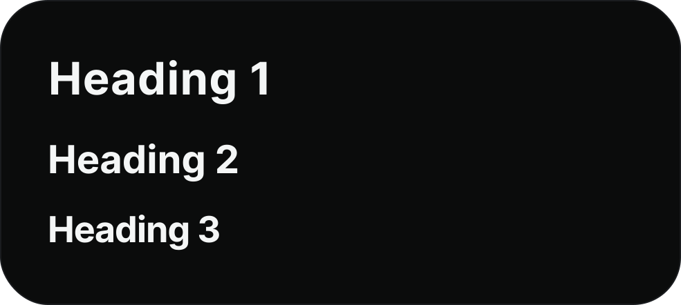
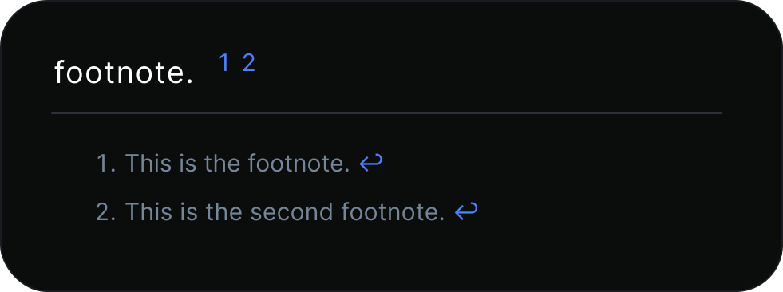
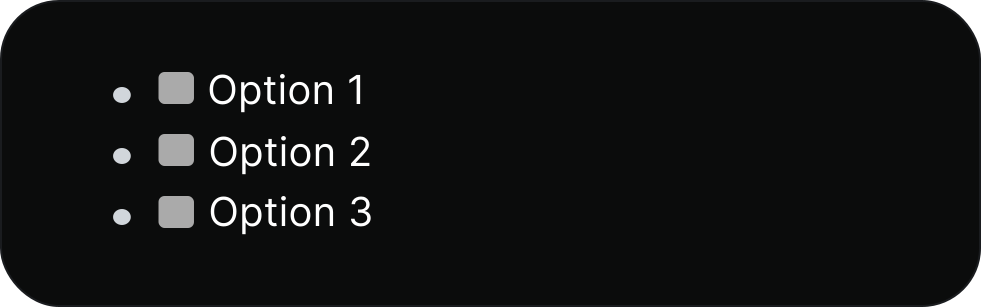

# Widgets

Widgets are blocks that lead to another platform. Some social widgets have a preview of the content, which you can configure through the widget settings.

## Widget character limits

YourSitee has set a maximum length of all widget titles and fields.&#x20;

| Widget                                                | Character limit    |
| ----------------------------------------------------- | ------------------ |
| [Rich Text (markdown)](widgets.md#rich-text-markdown) | 1,000              |
| External Link                                         | Title 32, link 250 |
| Title                                                 | 125                |
| YouTube video                                         | 250                |
| Twitter tweet/X post                                  | 250                |
| Twitch live stream                                    | 250                |
| Instagram post                                        | 250                |
| Pinterest pin                                         | 250                |
| SoundCloud track                                      | 250                |
| Spotify track                                         | 250                |
| Spotify album                                         | 250                |
| Spotify playlist                                      | 250                |
| Spotify artist                                        | 250                |

## Rich text (markdown)

YourSitee's markdown field supports quite a lot of syntaxes. The table below has, as far as we know, all the supported syntaxes in it.

| Element                                    | Syntax                                                                                                 | Preview                                                                                  |
| ------------------------------------------ | ------------------------------------------------------------------------------------------------------ | ---------------------------------------------------------------------------------------- |
| Heading                                    | 
#‎ H1 ##‎ H2 ###‎ H3
                                                                      |                |
| Bold                                       | \*‎‎\*‎‎‎‎‎‎‎bold text\*\*                                                                             |           |
| Italic                                     | \*‎‎Italicized text\*                                                                                  |         |
| Blockquote                                 | >‎ blockquote                                                                                          |          |
| Ordered list                               | 
1.‎ Item 1 2. ‎Item 2 3.‎ Item 3
                                                          | No preview available.                                                                    |
| Unordered list                             | 
-‎ Item 1 -‎ Item 2 -‎ Item 3
                                                             | No preview available.                                                                    |
| Code                                       | \`code\`                                                                                               |        |
| Codeblock                                  | \[4x space] this is code!                                                                              |        |
| Horizontal line                            | ‎ ---                                                                                                  |                    |
| Link (out of service)                      | \[‎title]\(https://yoursit.ee)                                                                         | ❌                                                                                        |
| Image                                      | !\[text]\(https://yoursit.ee/img)                                                                      | ❌                                                                                        |
| Table                                      | 
‎| This | is |  | ‎‎‎‎----------- | ----‎‎‎‎------- |  | a | very |  | cool | table! |
 |               |
| Footnote (blue text not clickable/working) | 
footnote. [^1] [^2] [^1] : This is the footnote. [^2]: This is the second footnote.
       |                |
| Strikethrough                              | \~‎‎YourSitee is bad.\~                                                                                |  |
| Emoji                                      | This is so funny! :‎joy:                                                                               |               |
| Task lisk (boxes are not clickable)        | 
[‎ ] Option 1 [‎ ] Option 2 [‎ ] Option 3
                                                 |               |

