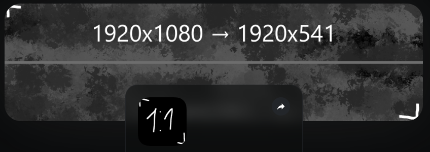
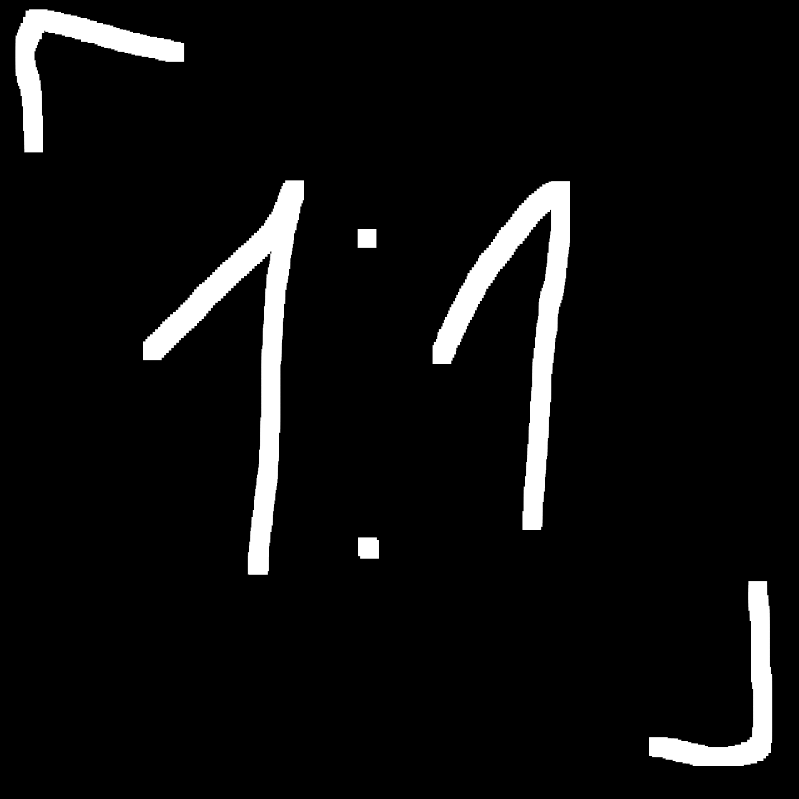

# Changing profile images


The profile pictures should be smaller than 8MiB in size.


## Editing profile banner

### 1: Customization button

You may want to go to your YourSitee page and press the "Customization"  button on the bottom navbar.\
After that select 'Upload image'.

### Finding the perfect size

After 768px screen width, the 3.55:1 aspect ratio applies.\
On smaller devices, the image height becomes larger.\
(Mobile users see a much larger image than PC users.)

|                            PC                           |                          Mobile                         |
| :-----------------------------------------------------: | :-----------------------------------------------------: |
|  |  |

3.55:1 = 1920x1080 → 1920x541

When you choose a background image, you can't move it around. So, if you want people using PCs to see a character or something important, make sure to place your content within that box.

Example:\

## Editing profile picture

### 1: Edit mode

On your YourSitee page click the  button, this switches you to edit mode and you can interact with your "cards".

### 2: Profile card

Click on your profile card. This contains your profile image, display name, username, etc.

### 3: Uploading profile picture

Under the Profile picture section click on the "Change" button.

### Disclaimer


The 3.55:1 ratio isn't used for profile pictures. Instead, they have a 1:1 ratio.



## Contributors

[BalazsManus](../contributors.md#balazsmanus)
