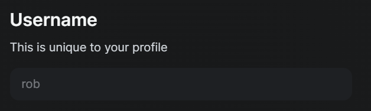

# Changing your username

Written by:  [Robbie](../about/contributors.md#robskan-project-lead)


**WARNING!** You can only update your username every 12 months.



When you change your username, it also updates your profile link. So, if you switch your username from hello to world, your link will change from yoursit.ee/hello to yoursit.ee/world.


## 1: Edit mode

Go to the [YourSitee website](https://yoursit.ee) and log in. Then, at the bottom of the screen, click the  button to enter Edit mode. Click the avatar image to open the YourSitee Account Settings.

## 2: Edit profile card

When in edit mode, click anywhere on the widget that contains your profile icon, username, and bio. A screen should pop up where you can edit anything about the profile card. Scroll down until you see 'Username' (image below).

<figure><figcaption></figcaption></figure>

Type the new username you would like to use and save your changes.

Done! Your new username is now in use!
