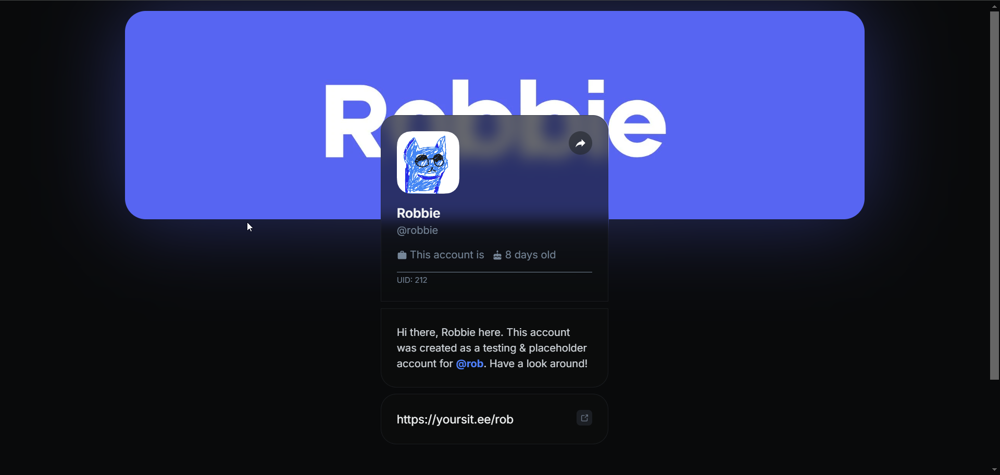
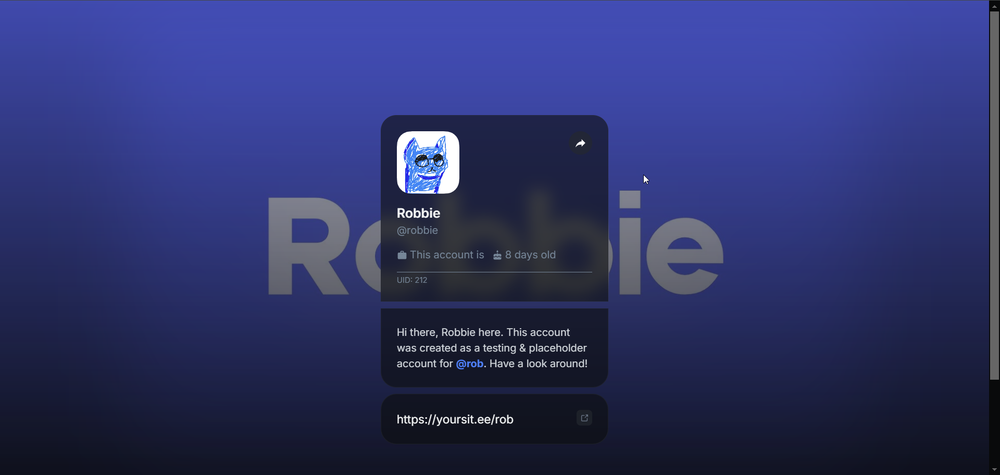
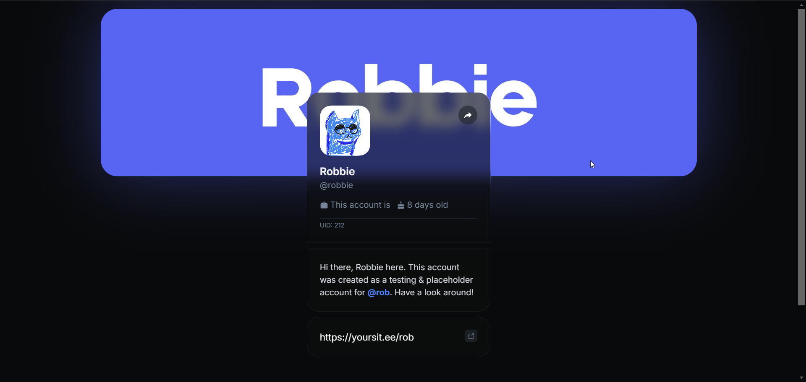
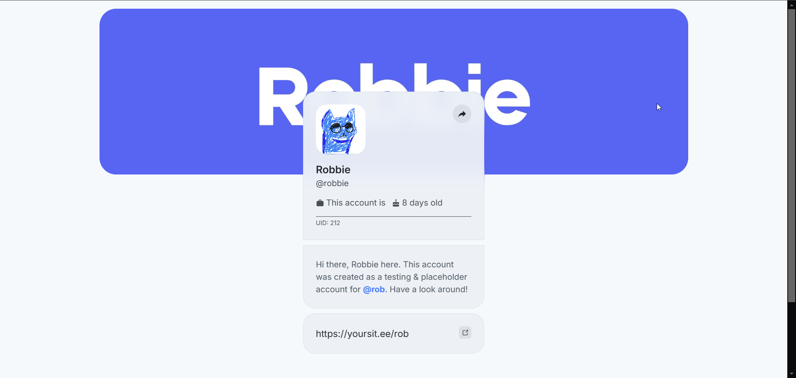
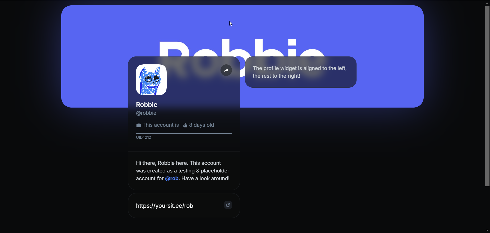
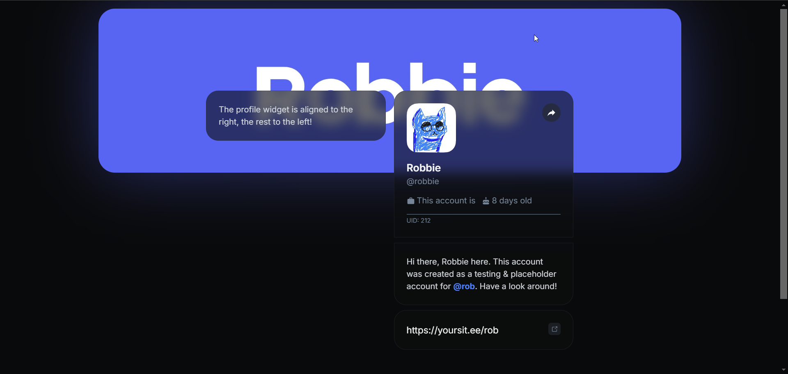

# Customization

The customization tab offers personalization for your profile. This allows you to express yourself even more!

## Customization

| Feature                                               | Default option | Secondary option |
| ----------------------------------------------------- | -------------- | ---------------- |
| [Profile banner](customization.md#profile-banner)     | Banner form    | Background form  |
| [Page theme](customization.md#page-theme)             | Dark mode      | Light mode       |
| [Widget alignment](customization.md#widget-alignment) | Left           | Right            |

## Profile banner

Your banner is usually the first thing that catches people's eyes when they check out your profile, right after your profile picture. That's why it's super important to make a banner that really stands out and makes a strong impression.

|                                Banner form — Default                                |                                   Background form                                   |
| :---------------------------------------------------------------------------------: | :---------------------------------------------------------------------------------: |
|  |  |

## Page theme

The theme of your profile really shapes how it feels. Just make sure it shows off who you are and makes it enjoyable for people to check out your profile.

|                                 Dark mode — Default                                 |                                      Light mode                                     |
| :---------------------------------------------------------------------------------: | :---------------------------------------------------------------------------------: |
|  |  |

## Widget alignment

Adjusting how your widgets are aligned can really change how your profile looks and feels. You can choose to align them to the left or the right, which helps direct your visitors' focus and makes everything look more organized.

|                                    Left — Default                                   |                                        Right                                        |
| :---------------------------------------------------------------------------------: | :---------------------------------------------------------------------------------: |
|  |  |
