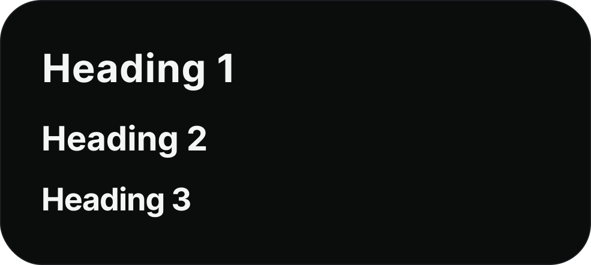
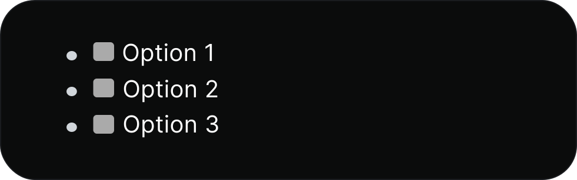

# Widgets

Widgets are blocks that lead to another platform. Some social widgets have a preview of the content, which you can configure through the widget settings.

## Widget character limits

YourSitee has set a maximum length of all widget titles and fields.&#x20;

| Widget                                                  | Character limit    |
| ------------------------------------------------------- | ------------------ |
| [Rich Text (markdown)](widgets.md#rich-text-markdown)   | 1,000              |
| [External Link](widgets.md#external-link)               | Title 32, link 250 |
| [Title](widgets.md#title)                               | 125                |
| [YouTube Video](widgets.md#youtube-video)               | 250                |
| [Twitter Tweet/X post](widgets.md#twitter-tweet-x-post) | 250                |
| [Twitch Live Stream](widgets.md#twitch-live-stream)     | 250                |
| [Instagram Post](widgets.md#instagram-post)             | 250                |
| [Pinterest Pin](widgets.md#pinterest-pin)               | 250                |
| [SoundCloud Track](widgets.md#soundcloud-track)         | 250                |
| [Spotify Track ](widgets.md#spotify)                    | 250                |
| [Spotify Album](widgets.md#spotify)                     | 250                |
| [Spotify Playlist](widgets.md#spotify)                  | 250                |
| [Spotify Artist](widgets.md#spotify)                    | 250                |

## Rich Text (markdown)

YourSitee's markdown field supports quite a lot of syntaxes. The table below has, as far as we know, all the supported syntaxes in it.

| Element                                    | Syntax                                                                                                 | Preview                                                                                  |
| ------------------------------------------ | ------------------------------------------------------------------------------------------------------ | ---------------------------------------------------------------------------------------- |
| Heading                                    | 
#‎ H1 ##‎ H2 ###‎ H3
                                                                      |                |
| Bold                                       | \*‎‎\*‎‎‎‎‎‎‎bold text\*\*                                                                             |           |
| Italic                                     | \*‎‎Italicized text\*                                                                                  |         |
| Blockquote                                 | >‎ blockquote                                                                                          |          |
| Ordered list                               | 
1.‎ Item 1 2. ‎Item 2 3.‎ Item 3
                                                          |               |
| Unordered list                             | 
-‎ Item 1 -‎ Item 2 -‎ Item 3
                                                             | .png>)                                               |
| Code                                       | \`Insert code here!\`                                                                                  |        |
| Codeblock                                  | \[4x space] Insert code here!                                                                          |        |
| Horizontal line                            | ‎ ---                                                                                                  |                    |
| Link (out of service)                      | \[‎title]\(https://yoursit.ee)                                                                         | No preview available.                                                                    |
| Image                                      | !\[text]\(https://yoursit.ee/img)                                                                      | No preview available.                                                                    |
| Table                                      | 
‎| This | is |  | ‎‎‎‎----------- | ----‎‎‎‎------- |  | a | very |  | cool | table! |
 |               |
| Footnote (blue text not clickable/working) | 
footnote. [^1] [^2] [^1] : This is the footnote. [^2]: This is the second footnote.
       |                |
| Strikethrough                              | \~‎‎YourSitee is bad.\~                                                                                |  |
| Emoji                                      | This is so funny! :‎joy:                                                                               |               |
| Task lisk (boxes are not clickable)        | 
[‎ ] Option 1 [‎ ] Option 2 [‎ ] Option 3
                                                 |               |

## External Link

YourSitee has an External Link field that works with many types of URLs, making it easy to connect to other websites. You can add links to websites, social media accounts, online shopping pages, and much more.

| Type           | Preview                                                                     |
| -------------- | --------------------------------------------------------------------------- |
| Title with URL |  |
| URL only       |  |

## Title

The title widget helps you sort your widgets, so your page is much more organized.

## YouTube Video

The YouTube Video widget lets you share a video you made or one that you really enjoy with the people visiting your page. You can even play a funny trick on someone by hiding a rickroll in there!

## Twitter Tweet/X Post

The Tweet widget allows you to show off a tweet you made or one that you think is cool to people visiting your page. It’s a fun way to share your best Twitter moments!


Due to issues with Twitter/X, the Twitter Tweet block may not work. This is a known bug.


## Twitch Live Stream

The Twitch widget allows you to share your own channel or one you really like. Whether you're having an awesome gaming session, doing something creative, or just chilling, it's a cool way to highlight what you are up to.

## Instagram Post

The Instagram Post widget allows you to display a recent photo, reel, or a special moment right on your page. Whether it’s a beautiful picture, a cool reel, or something that means a lot to you, it’s an awesome way to show off your personality and/or style.

## Pinterest Pin

The Pinterest widget allows you to show off a pin or a board that you created or really like. It could be a cool idea, DIY project, or anything that gets your creativity flowing.

## SoundCloud Track

The SoundCloud widget allows you to share a song you made or one you really like directly on your page. It doesn’t matter if it’s something you worked on, a song you love, or a whole playlist; it’s a fun way to add some music for your visitors.

## Spotify

The Spotify widgets allow you to showcase a song, album, playlist, or artist profile that you really enjoy on your page. It could be your favorite new song, a playlist that fits your vibe, or your own artist profile! It’s a cool way to let others know what you’re currently listening to lately.
