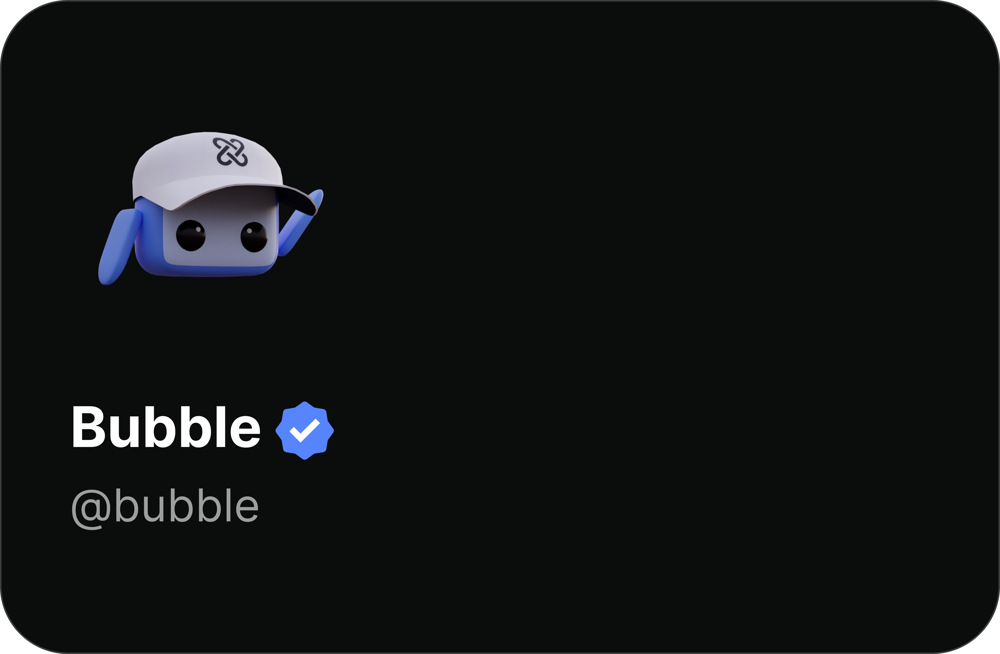

# Verified

The people with this badge are either influencers or partners of the YourSitee platform. They got this badge to stop anyone from pretending to be them.

## Variations

This badge has a few variations, as seen below:

|                                                          Icon                                                          |                        Name                         |
|:----------------------------------------------------------------------------------------------------------------------:|:---------------------------------------------------:|
|  |            Verified Person (most common)            |
|  | Verified & Partnered (mostly for official accounts) |

<figure><figcaption>
Visual representation of the Verified badge.
</figcaption></figure>

## How to apply?

At the moment, the only way to earn this badge is if a person from YourSitee personally hands it to you.
